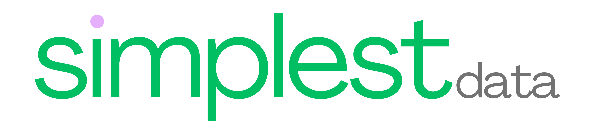

# Simplest Data SQL LRS

A SQL-based Learning Record Store with capability of supporting multiple SQL database management systems (DBMSs) like SQLite and Postgres. Based on the [xAPI specification](https://github.com/adlnet/xAPI-Spec/blob/master/xAPI-Communication.md). Forked from [lrsql](https://github.com/yetanalytics/lrsql) with respect to the original work from [Yet Analytics](https://github.com/yetanalytics/).

## What is a LRS (Learning Record Store)?

A Learning Record Store (LRS) is a persistent store for xAPI statements and associated attachments and documents. The full LRS specification can be found in Part 3 of the [xAPI specification](https://github.com/adlnet/xAPI-Spec/blob/master/xAPI-Communication.md).

## Releases

Simplest Data releases are coming soon *see above*. I would encourage following releases from the original project here: [Releases](https://github.com/yetanalytics/lrsql/releases). As this work will continue to pull from the original project, we will be following the original release notes. And we will commit to push our original work there if they will accept.

## Documentation

<!-- When you are updating this section, don't forget to also update doc/index.md -->

[SQL LRS Overview](doc/overview.md) ||
[API Documentation *coming soon*](coming-soon) ||
[Developer Documentation *coming soon*](coming-soon) ||
[Changelog *coming soon*](coming-soon)

### Related Information & Resources

[xAPI Base Standard IEEE 9274.1.1](https://opensource.ieee.org/xapi/xapi-base-standard-documentation) ||
[IEEE Learning Technology Standards Committee (LTSC)](https://sagroups.ieee.org/ltsc/workgroups/)

### FAQ

- [General Questions](doc/general_faq.md)
- [Troubleshooting](doc/troubleshooting.md)
- *Coming Soon* [Community Forums](doc/community.md)
- *Coming Soon* [Research](doc/research.md)

### Basic Configuration

- [Getting Started](doc/startup.md)
- [Setting up TLS/HTTPS](doc/https.md)
- [Authority Configuration](doc/authority.md)
- [Docker Image](doc/docker.md)
- [OpenID Connect Support](doc/oidc.md)
  - [Auth0 Setup Guide](doc/oidc/auth0.md)

### DBMS-specific Sections

- [Postgres](doc/postgres.md)
- [SQLite](doc/sqlite.md)
- *Coming Soon* [MongoDB](doc/mongodb.md)

### Reference

- [Configuration Variables](doc/env_vars.md)
- [HTTP Endpoints](doc/endpoints.md)
- [Developer Documentation](doc/dev.md)
- [Example AWS Deployment](doc/aws.md)
- [Reactions](doc/reactions.md)
  - [JSON Spec](doc/reactions/spec.md)
- [Sending xAPI statement(s) with Postman](doc/postman.md)

### Demos

- [Visualization with Apache Superset](doc/superset.md)
- [Additional Configuration Demos](doc/other_demos.md)
- *Coming Soon* [Open Sandbox Demo](doc/sandbox.md)

## Contribution

Before contributing to this project, please read the [Contribution Guidelines](CONTRIBUTING.md) and the [Code of Conduct](CODE_OF_CONDUCT.md), then consider contributing to the original [Yet Analytics LRSQL](https://github.com/yetanalytics/lrsql) project at this point in time.

## Background + xAPI

## TLA (Total Learning Architecture) - A Step Toward a More Complete Learning Ecosystem

## License

Distributed under the Apache License version 2.0. With much respect to the original work by Yet Analytics, Inc. Please view their work here: [Yet Analytics](https://github.com/yetanalytics/).
